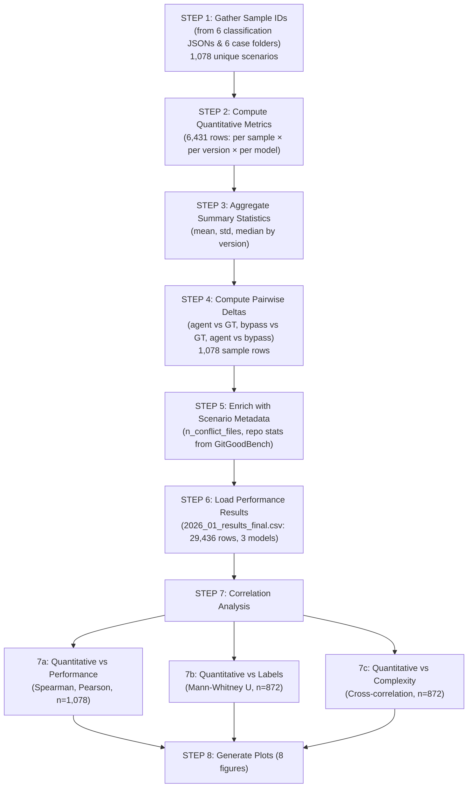

# Quantitative Change Metrics Analysis — Findings Summary

**Generated**: 2026-02-07  
**Dataset**: 1,078 unique merge conflict scenarios (3 models × pass/fail, from GitGoodBench)  
**Models**: GPT-5-nano, Qwen3-32B, LLaMA-3.1-8B  
**Module**: `src/results/quantitative/`

---

## Data Inputs

### Case Folders (raw merge artifacts — code, diffs, commit messages)

| Case Folder | Model | Type | Sample Subfolders |
|-------------|-------|------|-------------------|
| `data/labeled/2025-11-09-gpt5nano-failure-cases/` | GPT-5-nano | fail | 500 |
| `data/labeled/2025-11-11-gpt5nano-pass-cases/` | GPT-5-nano | pass | 315 |
| `data/labeled/2025-11-23-qwen3-failure-cases/` | Qwen3-32B | fail | 461 |
| `data/labeled/2025-12-03-qwen3-pass-cases/` | Qwen3-32B | pass | 415 |
| `data/labeled/2026-01-23-llama-pass-cases/` | LLaMA-3.1-8B | pass | 422 |
| `data/labeled/2026-02-03-llama-fail-cases/` | LLaMA-3.1-8B | fail | 481 |
| **Total** | | | **2,594** |

Each sample subfolder (e.g. `334950146121-1/`) contains:
- `default/<filename>/` — `original.txt` (ancestor), `a.txt`, `b.txt`, `ground_truth.txt`, `a.diff`, `b.diff`, `ground_truth.diff`, `a_commit_message.txt`, `b_commit_message.txt`
- `agent/<filename>.txt` — Single-agent LLM output
- `bypass/<filename>/bypass_<filename>.txt` — Multi-agent LLM output

### CSV Inputs

| File | Description | Rows | Used For |
|------|-------------|------|----------|
| `data/2026_01_results_final.csv` | Performance results (3 models × agent/bypass/base_a/base_b) | 29,436 rows (1,909 unique IDs) | Performance correlation (Step 7a), difficulty labels |
| `data/git_good_bench_merge_commits_all.csv` | GitGoodBench dataset with scenario metadata | 1,909 rows | Scenario enrichment (Step 5): n_conflict_files, n_total_conflicts, repo stats |
| `results/rq3/paired_data.csv` | RQ3 manual classification labels (wide format) | 872 rows | Label correlation (Step 7b) |
| `results/rq3/complexity_metrics.csv` | RQ3 code complexity metrics (radon) | 5,500 rows | Cross-correlation with complexity (Step 7c) |

### Classification JSONs (for sample ID extraction)

All 6 JSON files under `data/labeled/`:
- `2025-11-09-gpt5nano-failure-classifications.json`
- `2025-11-11-gpt5nano-pass-classifications.json`
- `2025-11-23-qwen3-failure-classifications.json`
- `2025-12-03-qwen3-pass-classifications.json`
- `2026-01-23-llama-pass-classifications.json`
- `2026-02-03-llama-fail-classifications.json`

### Execution Command

```bash
python -m src.results.quantitative.main \
    --case-folders \
        "data/labeled/2025-11-09-gpt5nano-failure-cases" \
        "data/labeled/2025-11-11-gpt5nano-pass-cases" \
        "data/labeled/2025-11-23-qwen3-failure-cases" \
        "data/labeled/2025-12-03-qwen3-pass-cases" \
        "data/labeled/2026-01-23-llama-pass-cases" \
        "data/labeled/2026-02-03-llama-fail-cases" \
    --results-csv "data/2026_01_results_final.csv" \
    --output-dir "results/rq_quantitative" \
    --dataset-csv "data/git_good_bench_merge_commits_all.csv" \
    --classification-jsons \
        "data/labeled/2025-11-09-gpt5nano-failure-classifications.json" \
        "data/labeled/2025-11-11-gpt5nano-pass-classifications.json" \
        "data/labeled/2025-11-23-qwen3-failure-classifications.json" \
        "data/labeled/2025-12-03-qwen3-pass-classifications.json" \
        "data/labeled/2026-01-23-llama-pass-classifications.json" \
        "data/labeled/2026-02-03-llama-fail-classifications.json" \
    --rq3-paired-csv "results/rq3/paired_data.csv" \
    --rq3-complexity-csv "results/rq3/complexity_metrics.csv"
```

---

## Methodology

The quantitative analysis pipeline computes metrics at multiple levels for each merge conflict scenario and then correlates them with existing RQ2 (performance) and RQ3 (manual labels, code complexity) results.

### Pipeline Steps



### Metrics Computed

| Category | Metrics | Source |
|----------|---------|--------|
| **Size** | LOC, SLOC, blank lines, comment lines | `radon.raw.analyze` on code text |
| **Change (vs Ancestor)** | LOC delta, SLOC delta | Difference from `original.txt` |
| **Diff** | Lines added/removed, net change, total change (magnitude), hunks, total diff lines | Parsed from stored `.diff` files or generated via `difflib.unified_diff` |
| **Commit** | n_commits_a, n_commits_b, n_commits_total | Parsed from `a_commit_message.txt`, `b_commit_message.txt` (delimited by `-----`) |

### Versions Analyzed

Six code versions per sample: **Previous** (ancestor/merge-base), **Parent A**, **Parent B**, **Ground Truth** (actual merge), **Agent** (single-agent LLM), **Bypass** (multi-agent LLM).

### Statistical Tests

- **Spearman & Pearson correlations** for continuous quantitative metrics vs continuous performance deltas
- **Mann-Whitney U test** for comparing quantitative metric distributions between samples with vs without a label
- **Bootstrap confidence intervals** (2,000 resamples, 95% CI) available in helper functions

---

## Key Findings

### Finding 1: Ground Truth File Size is the Strongest Predictor of Bypass Advantage

**File size (LOC/SLOC of the ground truth merge) is the single most powerful quantitative predictor of the performance difference between bypass (multi-agent) and agent (single-agent) approaches — by a wide margin.**

| Metric Pair | Spearman r | p-value | n |
|-------------|-----------|---------|---|
| gt_loc → delta_bleu3 | **0.503*** | 3.1e-70 | 1,078 |
| gt_sloc → delta_bleu3 | **0.497*** | 1.9e-68 | 1,078 |
| gt_loc → delta_similarity | **0.446*** | 7.8e-54 | 1,078 |
| gt_sloc → delta_similarity | **0.439*** | 4.0e-52 | 1,078 |
| gt_loc → delta_rouge_l | **0.397*** | 5.3e-42 | 1,078 |
| gt_sloc → delta_rouge_l | **0.392*** | 5.2e-41 | 1,078 |

**Interpretation**: Larger files dramatically and consistently favor the multi-agent bypass approach. A Spearman r of 0.50 for gt_loc → delta_bleu3 is a strong effect. The multi-agent decomposition strategy likely benefits from being able to divide-and-conquer larger files, while the single-agent approach struggles to maintain coherence across extensive code.

**Supporting files**:
- `quantitative_performance_correlation.csv` (rows 1–6)
- `quant_correlation_heatmap.png` (gt_loc and gt_sloc rows: bright red at r=0.50)
- `quant_metric_vs_performance.png` (bottom-right: GT Change Magnitude vs Delta Similarity)

---

### Finding 2: Ground Truth Diff Complexity Predicts Bypass Advantage

**The structural complexity of the ground truth merge (number of diff hunks) is the second strongest predictor, after file size.**

| Metric Pair | Spearman r | p-value | n |
|-------------|-----------|---------|---|
| gt_diff_hunks → delta_bleu3 | **0.291*** | 2.1e-22 | 1,078 |
| gt_diff_hunks → delta_similarity | **0.272*** | 8.4e-20 | 1,078 |
| gt_diff_hunks → delta_rouge_l | **0.232*** | 1.2e-14 | 1,078 |
| gt_diff_hunks → delta_exact_match | **−0.148*** | 1.1e-06 | 1,078 |

**Interpretation**: When the ground truth resolution involves many independent edit regions (hunks), the bypass approach produces better partial matches (similarity, BLEU, ROUGE-L) while exact matches become harder for both approaches. The multi-agent pipeline handles structurally complex merges with many scattered changes better than single-agent.

**Supporting files**:
- `quantitative_performance_correlation.csv` (rows 8–9, 13, 30)
- `quant_correlation_heatmap.png` (gt_diff_hunks row)

---

### Finding 3: Agent Output Divergence from Ground Truth Predicts Performance Gap

**How much the agent's output differs from ground truth (in diff magnitude) is a strong and consistent predictor of the bypass advantage — a new finding not visible in the smaller dataset.**

| Metric Pair | Spearman r | p-value | n |
|-------------|-----------|---------|---|
| agent_vs_gt_diff_total_change → delta_bleu3 | **0.244*** | 5.6e-16 | 1,070 |
| agent_vs_gt_diff_total_change → delta_similarity | **0.236*** | 5.8e-15 | 1,070 |
| agent_vs_gt_diff_total_change → delta_rouge_l | **0.233*** | 1.3e-14 | 1,070 |
| agent_vs_gt_diff_lines_removed → delta_rouge_l | **0.207*** | 8.1e-12 | 1,070 |

**Interpretation**: When the single-agent approach produces output that is far from the ground truth (high change magnitude), the bypass advantage is larger. This suggests that scenarios where the single-agent struggles (high deviation) are precisely those where the multi-agent approach adds the most value.

**Supporting files**:
- `quantitative_performance_correlation.csv` (rows 10–12, 16–18)
- `quant_correlation_heatmap.png` (agent_vs_gt rows)

---

### Finding 4: Bypass-GT Difference Correlates with Exact Match Advantage

**The amount the bypass output differs from ground truth positively correlates with exact match advantage for bypass.**

| Metric Pair | Spearman r | p-value | n |
|-------------|-----------|---------|---|
| bypass_vs_gt_diff_total_change → delta_exact_match | **0.219*** | 4.2e-13 | 1,070 |
| bypass_vs_gt_diff_lines_added → delta_exact_match | **0.211*** | 3.0e-12 | 1,070 |
| bypass_vs_gt_diff_lines_removed → delta_exact_match | **0.183*** | 1.7e-09 | 1,070 |
| bypass_vs_gt_diff_hunks → delta_exact_match | **0.150*** | 8.6e-07 | 1,070 |

**Interpretation**: This seemingly paradoxical result — that greater bypass deviation from GT helps bypass's exact match delta — reflects that in complex scenarios where bypass makes larger adjustments, the agent typically performs even worse. The bypass "exploratory" strategy pays off precisely when simple single-agent approaches fail most dramatically.

**Supporting files**:
- `quantitative_performance_correlation.csv` (rows 14–15, 20, 29)
- `quant_correlation_heatmap.png` (bypass_vs_gt rows, delta_exact_match column)

---

### Finding 5: "Favored Simplicity" Is the Dominant Label Association

**With the full 872-sample label dataset, "favored simplicity" shows overwhelmingly strong associations with bypass-GT divergence, now at levels of p < 10^-34.**

| Label × Metric | Mean (with) | Mean (without) | p-value | n_with / n_without |
|----------------|-------------|----------------|---------|---------------------|
| favored_simplicity × bypass_vs_gt_diff_hunks | **−4.72** | −0.99 | 6.5e-34 | 444 / 428 |
| favored_simplicity × bypass_vs_gt_diff_lines_removed | **−37.69** | −8.23 | 1.5e-27 | 444 / 428 |
| favored_simplicity × bypass_vs_gt_diff_total_change | **−95.86** | −27.18 | 2.3e-26 | 444 / 428 |
| favored_simplicity × bypass_vs_gt_diff_lines_added | **−58.17** | −18.95 | 2.5e-23 | 444 / 428 |
| favored_simplicity × n_commits_b | **6.04** | 2.66 | 3.7e-12 | 444 / 428 |
| favored_simplicity × gt_diff_hunks | **9.15** | 5.95 | 2.1e-09 | 444 / 428 |

**Interpretation**: When LLM resolutions are labeled as "favoring simplicity," the bypass output deviates significantly more from ground truth (larger negative values = bypass is farther from GT). These scenarios have more complex ground truth merges (more hunks, more commits). The LLM simplifies because the true resolution requires extensive, nuanced changes that the model cannot fully replicate.

**Supporting files**:
- `quantitative_label_correlation.csv` (rows 1–5, 10–11, 17–19)
- `quant_metrics_by_label.png`

---

### Finding 6: "Unclear" Scenarios Are Characteristically Simpler

**Scenarios labeled "unclear" have significantly smaller and simpler ground truth merges — a new finding from the larger dataset.**

| Label × Metric | Mean (with) | Mean (without) | p-value | n_with / n_without |
|----------------|-------------|----------------|---------|---------------------|
| unclear × gt_diff_lines_removed | **14.74** | 57.32 | 3.9e-11 | 94 / 778 |
| unclear × gt_diff_hunks | **3.61** | 8.06 | 1.0e-10 | 94 / 778 |
| unclear × gt_diff_total_change | **81.10** | 164.85 | 9.4e-09 | 94 / 778 |

**Interpretation**: "Unclear" classifications tend to occur on scenarios with small, focused merges — likely because when the ground truth change is minimal, it's harder to characterize what the LLM did wrong (or right). The ambiguity of the label reflects the ambiguity of the change itself.

**Supporting files**:
- `quantitative_label_correlation.csv` (rows 13, 15, 21)

---

### Finding 7: "Detailed Commit Message" Correlates with Larger Agent Divergence

**Scenarios with detailed commit messages show significantly larger agent-bypass divergence — a clear multi-model finding.**

| Label × Metric | Mean (with) | Mean (without) | p-value | n_with / n_without |
|----------------|-------------|----------------|---------|---------------------|
| detailed_commit_message × agent_vs_bypass_diff_lines_added | **30.06** | 87.29 | 2.2e-09 | 179 / 693 |
| detailed_commit_message × agent_vs_gt_loc_delta | **−50.13** | 3.75 | 1.9e-08 | 179 / 693 |
| detailed_commit_message × agent_vs_gt_diff_lines_added | **−7.85** | 47.42 | 6.5e-08 | 179 / 693 |

**Interpretation**: When commit messages are detailed, the agent tends to produce output that is significantly smaller than ground truth (LOC delta = −50), while in less-detailed scenarios the agent adds code. Detailed messages may describe complex changes that the single-agent approach under-realizes.

**Supporting files**:
- `quantitative_label_correlation.csv` (rows 20, 23–25, 27–28, 30)

---

### Finding 8: Commit Counts Have Modest but Significant Effects at Scale

**With the full multi-model dataset, commit counts remain statistically significant but are substantially weaker predictors than file size — a revision from the smaller pilot.**

| Metric Pair | Spearman r | p-value | n |
|-------------|-----------|---------|---|
| n_commits_total → delta_rouge_l | **0.139*** | 4.8e-06 | 1,078 |
| n_commits_total → delta_exact_match | **−0.142*** | 3.1e-06 | 1,078 |
| n_commits_total → delta_bleu3 | **0.132*** | 1.5e-05 | 1,078 |
| n_commits_a → delta_rouge_l | **0.124*** | 4.5e-05 | 1,078 |

**Interpretation**: More commits still modestly favor the bypass approach for partial matching and modestly hurt exact match. However, the effect is much weaker (r ≈ 0.13) than file size (r ≈ 0.50), indicating that the structural complexity of the merge target matters far more than the volume of development activity.

**Supporting files**:
- `quantitative_performance_correlation.csv` (rows 32, 35, 45)
- `quant_correlation_heatmap.png` (n_commits rows)
- `quant_metric_vs_performance.png` (left panels: Total Commits)

---

### Finding 9: Agent Output is Systematically Smaller; Bypass Closely Matches GT

**Summary statistics across 1,078 scenarios confirm that agent output is consistently smaller than ground truth, while bypass output tracks GT much more closely.**

| Version | N | Mean LOC | Mean SLOC | Median LOC | Mean Diff Total Change | Median Diff Hunks |
|---------|---|----------|-----------|------------|----------------------|-------------------|
| Previous (Ancestor) | 1,078 | 628.8 | 498.7 | 336.5 | 0.0 | 0.0 |
| Parent A | 1,068 | 670.8 | 528.2 | 388.5 | 112.5 | 5.4 |
| Parent B | 1,067 | 664.2 | 526.5 | 370.0 | 83.0 | 5.2 |
| **Ground Truth** | **1,078** | **681.3** | **536.7** | **387.5** | **161.8** | **7.9** |
| **Agent** | **1,070** | **598.0** | **469.9** | **342.5** | **285.2** | **7.0** |
| **Bypass** | **1,070** | **664.0** | **523.6** | **374.5** | **94.4** | **4.9** |

Key observations:
- **Agent LOC (598) is 12% smaller than GT (681)** — agent consistently under-generates code
- **Bypass LOC (664) is within 2.5% of GT (681)** — bypass matches GT size closely
- **Agent diff total change (285) is 76% higher than GT (162)** — agent makes excessive modifications relative to the ancestor
- **Bypass diff total change (94) is 42% lower than GT (162)** — bypass is more conservative than GT

**Supporting files**:
- `quantitative_summary.csv`
- `quant_summary_table.png`
- `quant_size_by_version.png`
- `quant_change_magnitude_by_version.png`

---

### Finding 10: Commit Distribution and Difficulty Effects

**Commit distribution remains heavily right-skewed. Difficulty level clearly separates change magnitude.**

| Metric | Median | Mean | Max |
|--------|--------|------|-----|
| Commits (Branch A) | 3 | 8.5 | 528 |
| Commits (Branch B) | 2 | 4.2 | 153 |
| Total Commits | 6 | 12.7 | 531 |

From the ground truth metrics by difficulty:
- **Easy**: Small, focused changes (low change magnitude, few hunks)
- **Medium**: Moderate changes with wide spread — most variability
- **Hard**: Largest changes with highest spread in LOC delta and diff hunks

**Supporting files**:
- `quant_commit_count_distribution.png`
- `quant_change_by_difficulty.png`

---

## Summary of Changes vs Pilot Analysis

| Finding | Pilot (203 GPT-5-nano only) | Full Dataset (1,078, 3 models) |
|---------|----------------------------|-------------------------------|
| **#1 Predictor** | Commit count (r=0.415) | **File size (r=0.503)** — major shift |
| **Commit count effect** | Strong (r=0.38–0.41) | Modest (r=0.13) — attenuated 3× |
| **GT diff hunks** | r=0.23–0.27 | r=0.23–0.29 — stable |
| **Agent divergence** | Not significant | **r=0.23–0.24*** — new finding |
| **Bypass-GT exact match** | r=0.28 | r=0.22 — slightly weaker |
| **Favored simplicity** | p<10^-5 | **p<10^-34** — dramatically stronger |
| **Unclear label** | Not significant | **p<10^-10** — new finding |
| **Detailed commit msg** | Not significant | **p<10^-8** — new finding |
| **Agent size deficit** | SLOC 319 vs GT 376 (15%) | SLOC 470 vs GT 537 (12%) — confirmed |
| **n_samples** | 199–203 | 1,062–1,078 — 5× larger |

---

## File Reference

### CSV Outputs

| File | Description | Rows × Cols |
|------|-------------|-------------|
| `quantitative_metrics.csv` | Raw metrics per sample × version | 6,431 × 18 |
| `quantitative_summary.csv` | Aggregated stats per version | 6 × 78 |
| `quantitative_deltas.csv` | Pairwise deltas per sample | 1,078 × 37 |
| `quantitative_deltas_enriched.csv` | Deltas + scenario metadata | 1,078 × 43 |
| `quantitative_performance_correlation.csv` | Spearman/Pearson with performance | 140 × 7 |
| `quantitative_label_correlation.csv` | Mann-Whitney U for labels | 490 × 9 |
| `quantitative_complexity_cross.csv` | Cross-correlation with complexity | 840 × 8 |

### Figures

| Figure | Description |
|--------|-------------|
| `quant_size_by_version.png` | Boxplots: LOC, SLOC, blank/comment lines by version |
| `quant_change_magnitude_by_version.png` | Boxplots: diff total change, lines added/removed by version |
| `quant_commit_count_distribution.png` | Histograms: branch A, B, total commit counts |
| `quant_change_by_difficulty.png` | Boxplots: GT change metrics by difficulty level |
| `quant_correlation_heatmap.png` | Heatmap: Spearman r with significance stars |
| `quant_metric_vs_performance.png` | Scatter: total commits and GT change vs performance deltas |
| `quant_metrics_by_label.png` | Grouped bar: mean GT diff total change by label |
| `quant_summary_table.png` | Summary table of key metrics by version |

### Source Code

| File | Purpose |
|------|---------|
| `src/results/quantitative/__init__.py` | Module exports |
| `src/results/quantitative/config.py` | Constants, metric definitions, `QuantConfig` dataclass |
| `src/results/quantitative/metrics.py` | Core computation: diff parsing, LOC/SLOC, commit counting |
| `src/results/quantitative/loader.py` | Data loading from case folders, batch processing, aggregation |
| `src/results/quantitative/correlations.py` | Correlation analysis (Spearman, Pearson, Mann-Whitney U) |
| `src/results/quantitative/plots.py` | All visualization functions |
| `src/results/quantitative/main.py` | 8-step orchestrator pipeline with CLI (`tyro`) |
