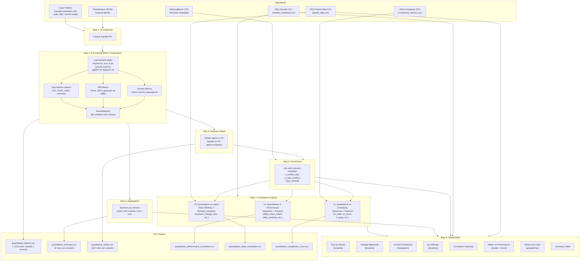
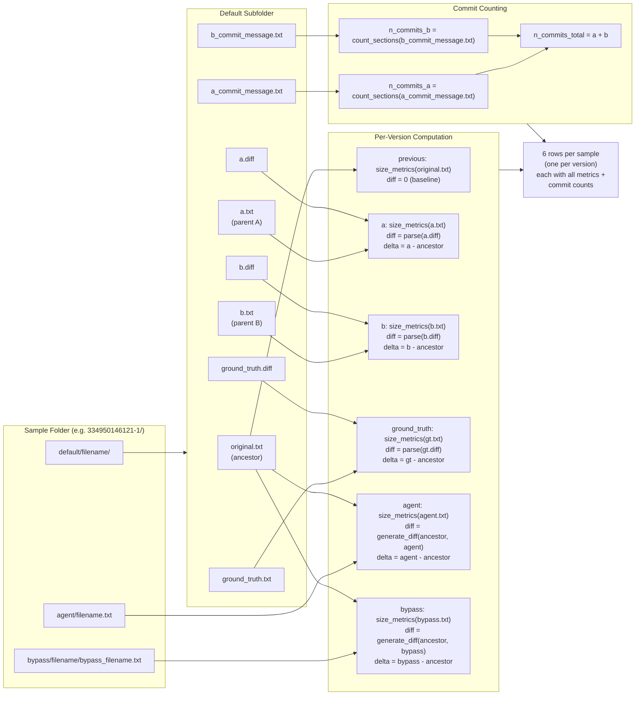
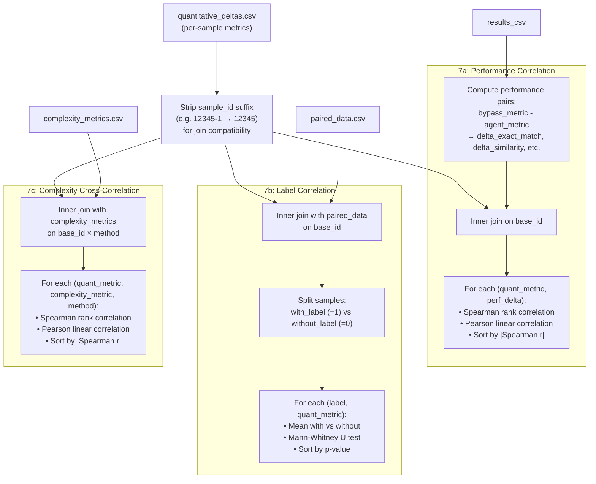

# Quantitative Change Metrics — Methodology

## Concrete Data Inputs Used

### Case Folders (6 folders, 2,594 total sample subfolders)

| # | Case Folder | Model | Type | Subfolders |
|---|-------------|-------|------|------------|
| 1 | `data/labeled/2025-11-09-gpt5nano-failure-cases/` | GPT-5-nano | fail | 500 |
| 2 | `data/labeled/2025-11-11-gpt5nano-pass-cases/` | GPT-5-nano | pass | 315 |
| 3 | `data/labeled/2025-11-23-qwen3-failure-cases/` | Qwen3-32B | fail | 461 |
| 4 | `data/labeled/2025-12-03-qwen3-pass-cases/` | Qwen3-32B | pass | 415 |
| 5 | `data/labeled/2026-01-23-llama-pass-cases/` | LLaMA-3.1-8B | pass | 422 |
| 6 | `data/labeled/2026-02-03-llama-fail-cases/` | LLaMA-3.1-8B | fail | 481 |

Each subfolder contains: `default/` (ancestor, parents, GT, diffs, commit messages), `agent/` (single-agent output), `bypass/` (multi-agent output).

### CSV Inputs

| Input | Path | Description |
|-------|------|-------------|
| Performance results | `data/2026_01_results_final.csv` | 29,436 rows (1,909 unique IDs); columns: `id`, `model_name`, `eval_method`, `exact_match`, `similarity`, `bleu3`, `rouge_l`, `difficulty`, `project_size`, etc. Models: GPT-5-nano, Qwen3-32B, LLaMA-3.1-8B |
| Scenario metadata | `data/git_good_bench_merge_commits_all.csv` | 1,909 rows; used for scenario enrichment (n_conflict_files, n_total_conflicts, repo_commits, repo_code_lines, repo_contributors) |
| RQ3 paired labels | `results/rq3/paired_data.csv` | 872 rows; columns: `id`, binary label columns (`favored_simplicity`, `structural_change_bias`, etc.), per-method performance, deltas |
| RQ3 complexity | `results/rq3/complexity_metrics.csv` | 5,500 rows; columns: `sample_id`, `method`, `sloc`, `lloc`, `cc_total`, `cc_avg`, `mi_score`, `h_difficulty`, `h_bugs`, etc. |

### Classification JSONs (6 files)

All under `data/labeled/`: `2025-11-09-gpt5nano-failure-classifications.json`, `2025-11-11-gpt5nano-pass-classifications.json`, `2025-11-23-qwen3-failure-classifications.json`, `2025-12-03-qwen3-pass-classifications.json`, `2026-01-23-llama-pass-classifications.json`, `2026-02-03-llama-fail-classifications.json`

### Output Directory

All outputs written to `results/rq_quantitative/`.

---

## High-Level Pipeline Flow



## Detailed Metric Computation

### For Each Sample Folder



### Correlation Analysis Detail



## Source Code Architecture

```
src/analysis/quantitative/
├── __init__.py           # Exports: generate_all_quantitative, QuantFlags
├── config.py             # Constants, QuantConfig dataclass
│   ├── VERSIONS, VERSION_DISPLAY_NAMES, VERSION_COLORS
│   ├── SIZE_METRICS, CHANGE_METRICS, DIFF_METRICS, COMMIT_METRICS
│   ├── PERFORMANCE_METRICS, METRIC_DISPLAY_NAMES
│   ├── Bucket definitions (commit count, change magnitude, LOC delta)
│   └── QuantConfig (n_bootstrap, ci_level, figsize, colors, ...)
├── metrics.py            # Core computation (stateless, no I/O)
│   ├── DiffMetrics, parse_unified_diff()
│   ├── SizeMetrics, compute_size_metrics()  [uses radon]
│   ├── count_commits()
│   └── VersionMetrics, compute_version_metrics()
├── loader.py             # Data loading + batch processing
│   ├── SampleData (container for all raw artifacts)
│   ├── load_sample_data() → SampleData
│   ├── compute_sample_quantitative_metrics() → list[dict]
│   ├── process_all_samples() → pd.DataFrame
│   ├── aggregate_metrics_by_version() → pd.DataFrame
│   └── compute_quantitative_deltas() → pd.DataFrame
├── correlations.py       # Statistical analysis
│   ├── _bootstrap_ci(), _coerce_exact_match()
│   ├── _prepare_performance_pairs()
│   ├── compute_performance_correlations()   [Spearman, Pearson]
│   ├── compute_label_correlations()         [Mann-Whitney U]
│   └── compute_complexity_cross_correlations()
├── plots.py              # All visualization functions
│   ├── plot_size_by_version()               [4-panel boxplot]
│   ├── plot_change_magnitude_by_version()   [3-panel boxplot]
│   ├── plot_commit_count_distribution()     [3-panel histogram]
│   ├── plot_change_by_difficulty()          [3-panel by easy/med/hard]
│   ├── plot_correlation_heatmap()           [annotated heatmap]
│   ├── plot_metric_vs_performance_scatter() [2×2 scatter + trend]
│   ├── plot_metrics_by_label()              [grouped horizontal bar]
│   └── plot_summary_table()                 [rendered table]
└── main.py               # 8-step orchestrator + CLI (tyro)
    ├── QuantFlags (CLI dataclass)
    ├── _load_scenario_metadata()
    ├── _extract_sample_ids_from_case_folder()
    ├── _extract_sample_ids_from_json()
    └── generate_all_quantitative()
```
